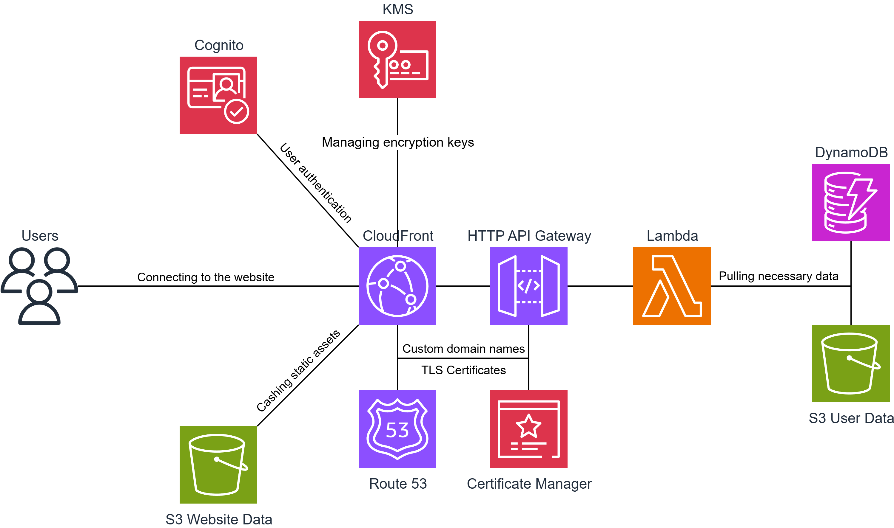

# SecDrive: Secure Cloud Storage Solution

## Overview
SecDrive is a security-focused cloud storage application that prioritizes user data protection through advanced encryption and AWS security services integration.

## Key Features
- End-to-end encryption for all stored files and user data
- Zero-knowledge architecture ensuring only users can access their data
- Multi-factor authentication implementation
- Automated threat detection and prevention
- Secure file sharing with granular permission controls

## Technology Stack
- Frontend: VueJS with TailwindCSS
- Backend: AWS Lambda function written in GO, HTTP API Gateway
- Storage: AWS S3, AWS DynamoDB
- Security: AWS KMS for key management and client-side encryption, Cognito for authentication, ACM for TLS certificates
- Monitoring: CloudWatch and AWS Shield for threat detection
- Additional: Route53 for custom domain names

## AWS Architecture

## Security Implementation
- AES-256 encryption for data at rest
- TLS/SSL for data in transit
- Immutable audit logs for security compliance
- IAM role-based access controls
- Regular security assessments and penetration testing

## Getting Started
See documentation for deployment instructions and security best practices

## Status
This project is currently in development as part of S4 CyberSecurity coursework.